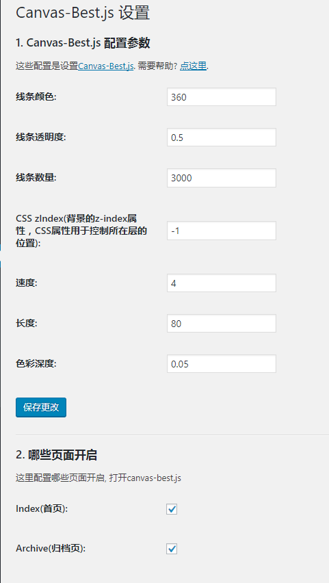

# canvas-best-for-wp
A wordpress plugin of [canvas-best.js](https://github.com/zhi/canvas-best.js). 

Online Demo: [http://www.atool.org/](http://www.atool.org/)

## How to use?

### One:

Search on wordpress, keywords is `canvas-best`, then install.

### Two: 

1. `Download package` from [WP_Canvas_Best.zip](https://github.com/aTool-org/canvas-best-for-wp/archive/master.zip)

2. `unzip the package`, and put the folder into `wp-content\plugins` dir, or `upload the zip` in the managment page direactly.

3. refresh the admin page, click `OPEN` the plugin.

## Screenshot

**Plugin Admin Setting**

## Node

 - Code template from [fyaconiello/wp_plugin_template](https://github.com/fyaconiello/wp_plugin_template)
